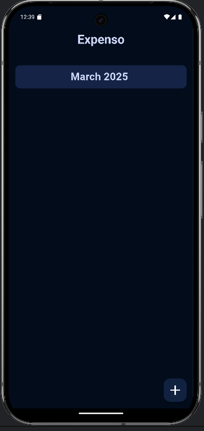
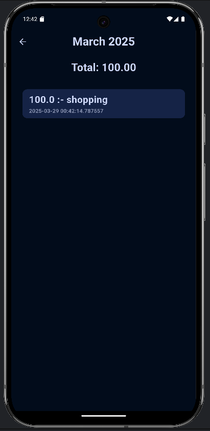
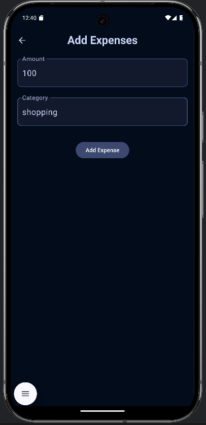

# Expense Tracker - **Expenso**

A simple Flutter app to track your monthly expenses, built for learning and personal use. It organizes expenses by month, lets you add new expenses, and shows totals—all stored locally on your device.

## Features
- **Monthly Overview**: View a list of months with expenses.
- **Detailed Breakdown**: Tap a month to see its expenses and total spent.
- **Add Expenses**: Easily add new expenses with amount and category.
- **Local Storage**: Uses `shared_preferences` to save data on your device—no backend needed.

## Screenshots  
- Home Screen: List of months  

- Detail Screen: Expenses for a selected month 

 
- Add Screen: Form to add a new expense

## Getting Started

### Prerequisites
- **Flutter**: Ensure you have Flutter installed (version 3.22.0 or later recommended for Dart 3.4.0+).
- **Dart**: Comes with Flutter.
- **Device/Emulator**: To run the app.

### Installation
1. **Clone the Repository**:
   git clone https://github.com/AvezChadchan/Expenso.git
2. **Navigate to the Project**:
   cd Expenso
3. **Get Dependencies**:
   flutter pub get
4. **Run the App**:
   flutter run

**Usage**
**Home Screen**: See a list of months with expenses.

**View Details**: Tap a month to see its expenses and total.

**Add Expense**:
Click the + button on the home screen.
Enter the amount and category.
Press "Add" to save the expense.

**Data Persistence**: Expenses are saved locally and persist between app restarts.

**Project Structure**:
lib/main.dart: Main app file with all screens and logic.
pubspec.yaml: Lists dependencies (shared_preferences, intl).

**Dependencies**:
shared_preferences: For local storage.

**Contributing**:
This is a learning project, but feel free to fork and experiment! If you have suggestions, open an issue or submit a pull request.

**About**:
Built by **Avez Chadchan** as part of my Flutter learning journey. Inspired by the need to track expenses without a backend. Thanks to Grok (xAI) for guidance!